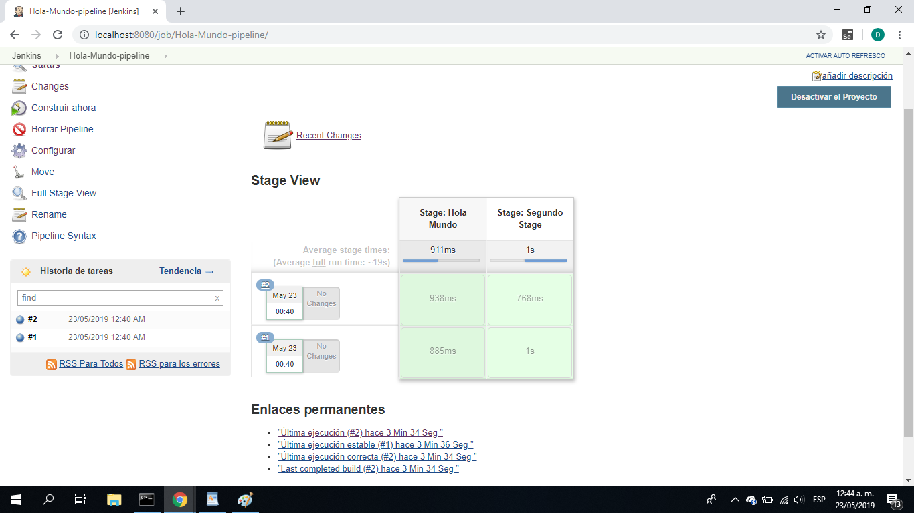

# Linea de automatizacion de Sotfware

# Integrantes
* **Anderson fabian solano cubillos** - *20142020089* 
* **Daniel pepinosa** - *20142020094* 
* **Sebastian lopez** - *20142020013* 

En el siguiente trabajo se desarrolló un Hola mundo por python para realizar la linea de automatización de la siguiente manera:

* Build

Se implemento un algoritmo base del hola mundo . para su construcción utilizamos Jenkins y lo ponemos en marcha.

* Testing

El testing se realizó con un la librería de python unittest y tambien se comprobó su funcionamiento con Jenkins.

## Pipeline (Hola Mundo)

## Docker

Crear volumen: 

`$ docker volume create jenkins_home`

Iniciar contenedor de Jenkins con Docker:  

`$ docker run --rm -v jenkins_home:/var/jenkins_home -v /var/run/docker.sock:/var/run/docker.sock -p 8080:8080 20142020094/jenkins-with-docker`

* **GitHub** - Plataforma de desarrollo colaborativo.

